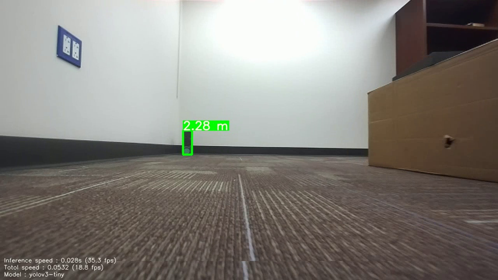
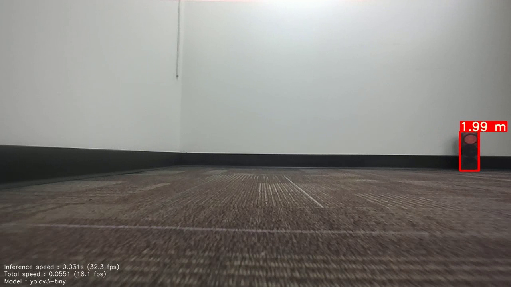

# Object detection.

Currently consists the implementation of the following algorithms.   

1. YOLOv3

<!-- -->

The code consists of using ZED camera api in c++. All the required documentation can be found here https://www.stereolabs.com/zed/.

To get higher frame rate, multi-processing with shared memory between processes to transfer image data is used. Camera data is written in an assigned memory by a node (C++) and another node (Python with utilizing a module created from C++ using pybind11) contains the object detection pipeline (pytorch).

## YOLO.

YOLO is a popular object detection algorithm which has a good balance of speed and accuracy.

yolov1 paper : https://arxiv.org/pdf/1506.02640.pdf
yolov3 paper : https://arxiv.org/pdf/1804.02767.pdf

Useful links:

Pytorch tutorials : https://www.youtube.com/watch?v=2S1dgHpqCdk&list=PLhhyoLH6IjfxeoooqP9rhU3HJIAVAJ3Vz
Obj detection terminology, yolov1/v3 tutorial : https://www.youtube.com/watch?v=t-phGBfPEZ4&list=PLhhyoLH6Ijfw0TpCTVTNk42NN08H6UvNq
pybind11 tutorial : https://www.youtube.com/watch?v=_5T70cAXDJ0&t=426s
pybind11 numpy docs : https://pybind11.readthedocs.io/en/stable/advanced/pycpp/numpy.html

